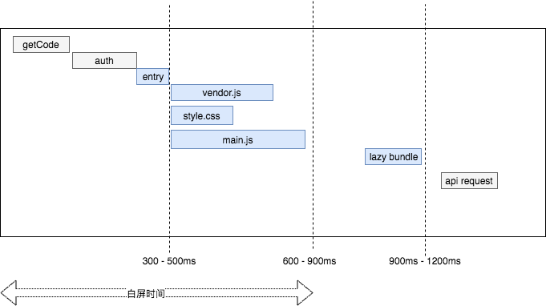
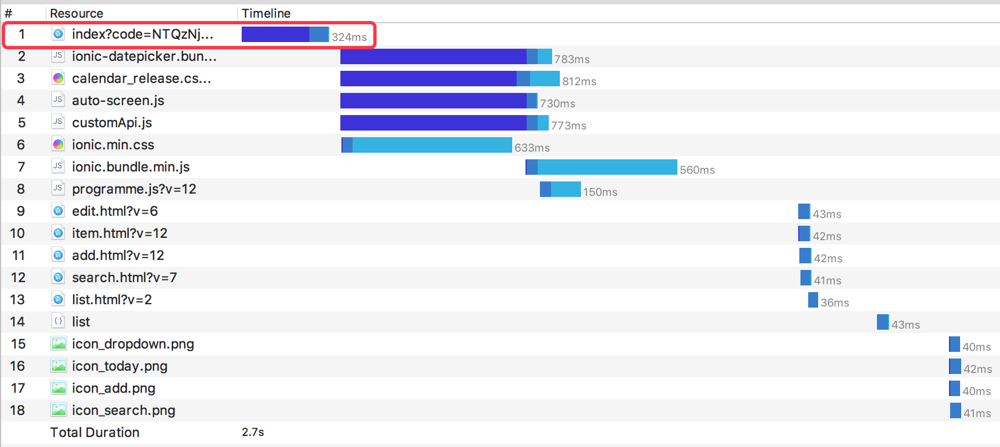

# 现状，瓶颈分析

本节旨在分析应用加载过程中的瓶颈和应对措施

## 1.应用加载过程

> 注: 以下数据以工作宝 Android 6.0 测试.  服务由阿里云提供

1.  首先`客户端`会携带一些会话信息(用户，当前语言，重定向 url)，以及向`EIM`进行认证并获取一个`Code`

    
    平均消耗在 115ms 左右

2.  EIM 响应，让浏览器携带 code 重定向应用服务器地址。应用服务器会在这里对 Code 进行解析和鉴权。并将用户信息保存在 session 中。

    
    平均消耗在 140ms 左右

    目前已存在的应用中对于 Code 有三种处理方式：

    * `日程`为代表的：鉴权完成同时返回页面(html)，浏览器可以直接渲染出来. 即直接通过 Java 的 template 渲染将页面，并在页面中携带用户信息
      

    * `考勤`为代表的: 鉴权完成后返回 302，让浏览器重定向获取 APP 的 index.html 入口
      

    * `位置`为代表的：从 EIM 获取到 Code 之后，直接跳转到 index.html 入口. 然后通过 getToken 和应用后端换取 Token, 后续使用 Token 的方式进行鉴权
      

    对比:

    * `日程`鉴权完成后立即返回页面, 是优于`考勤`的。考勤使用重定向的方式会让浏览器浪费一次请求. 但是基于当前前端应用的构建方式，html 文件是构建工具自动生成的。所以`考勤`的方式更方便一点
    * 而`位置`应用使用的方式则弥补了前面两者缺陷。在拿到 Code 后，马上开始获取页面，在请求资源渲染页面的同时向服务端鉴权。最大化地减少的白屏时间。
    * 更好的方案

3.  拿到 html 页面后，浏览器开始渲染流程。因为我们使用前端渲染的方式，只有等到所有‘必须’的资源加载完毕之后，用户才能看到有东西的页面。这个阶段才是前端能控制的‘主要战场’, 也是这次预研的主题

    
    影响这个阶段页面加载的因素有很多, 主要因素是资源的体积大小和分配情况. 这个阶段我们能做些什么?

    [*] 资源压缩, 压缩 JS 文件, CSS 文件,图片资源等
    [] 服务器 Gzip 压缩(目前没有开启, 开启能压缩 40%以上的文件体积)
    [] 服务器动静分离, 让更专业的静态服务器来伺服静态文件( 比如 Nginx, 目前是 Java). 这个需要基准测试证明
    [] 选择合适的技术栈, 减少依赖和代码重复, 平衡开发效率, 维护效率, 运行性能和 首屏性能
    [*] 适当分割文件, 平衡并行下载数和连接数
    [] 缓存优化. 这是本次的主题

## 选型分析

下面是目前前端主流选型的 对比, 暂时不考虑运行性能, 因为随着版本的迭代, React, Vue, Angular 三大框架的性能 已经差距不大. 在本次话题中, 框架及其附属 周边的体积, 影响首屏渲染的成本会高一些:

由上图可以看到, 现代前端框架做了很多工作的同时, 依旧保持苗条的身材. 比如`Vue`的核心, 只有 60KB, 这 60KB 实现了等价于
`React + React-DOM + Mobx + Mobx-React`(180K)的工作.

更为惊艳的是, `Preact` 这款轻量版的 React 只有 8K 大小, 非常适合移动端 的开发. 目前最新开发的应用, 如`扫码登录`, `安全验证`以及`CSP扫码登录`
等都使用了 Preact, 整个应用的体积(包括 业务逻辑代码)可以控制 100KB, 甚至 50KB 以内. 它非常适合这种场景.

由于定位不一样, Angular 等框架 体积都非常庞大. 暂时 不再未来选项之列. Ionic 是一个组件库+运行时, 放在这里比较似乎有点不公平

所以相比而言, `Jquery`或`Zepto.js`以及不具备竞争能力( 目前还有其适用场景).

更多角度的排名:

| 体积(核心) | 体积(+ 周边)              | 生态(+活跃的)      | 运行效率                   | 开发 效率                | 代码量                   |
| ---------- | ------------------------- | ------------------ | -------------------------- | ------------------------ | ------------------------ |
| Preact     | Preact                    | React/Vue          | React/Vue/Augular          | React/Vue/Augular/Preact | React/Vue/Augular/Preact |
| Zepto      | Vue(Vue-Router, Vuex)     | Augular            | Preact                     | AugularJS                | AugularJS                |
| Vue        | Zepto                     | AugularJS/Jquery   | Jquery/Zepto(依赖于开发者) | Zepto/Jquery             | Zepto/Jquery             |
| Jquery     | React(React-Router, Mobx) | Preact(兼容 React) | AugularJS                  |
| React      | Jquery                    | Zepto              |
| Augular    | React(Redux)              |
| AugularJS  | Augular                   |
| Ionic      | AugularJS                 |
|            | Ionic                     |
