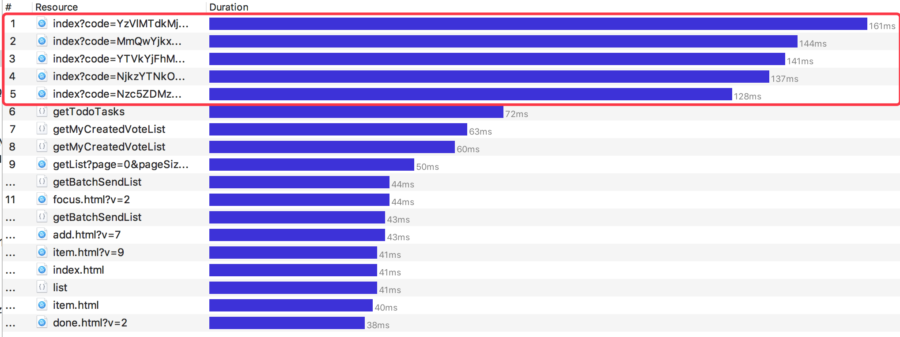
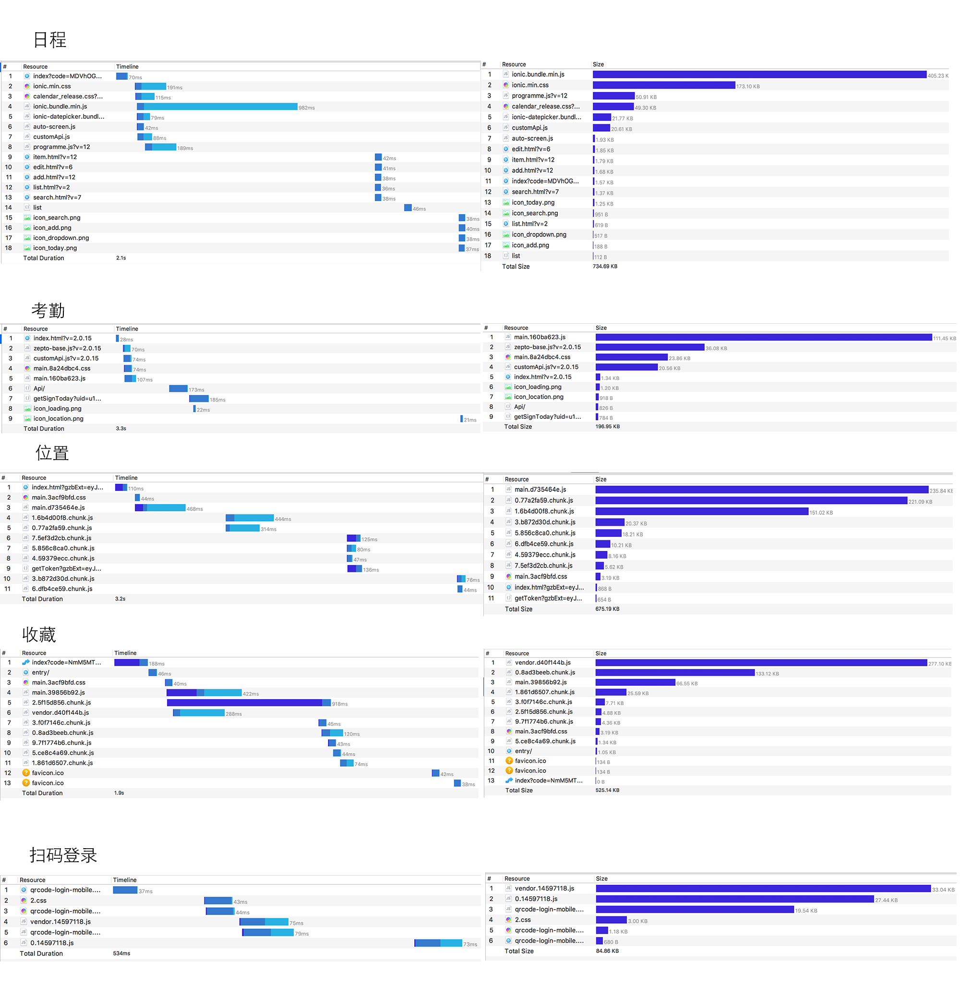
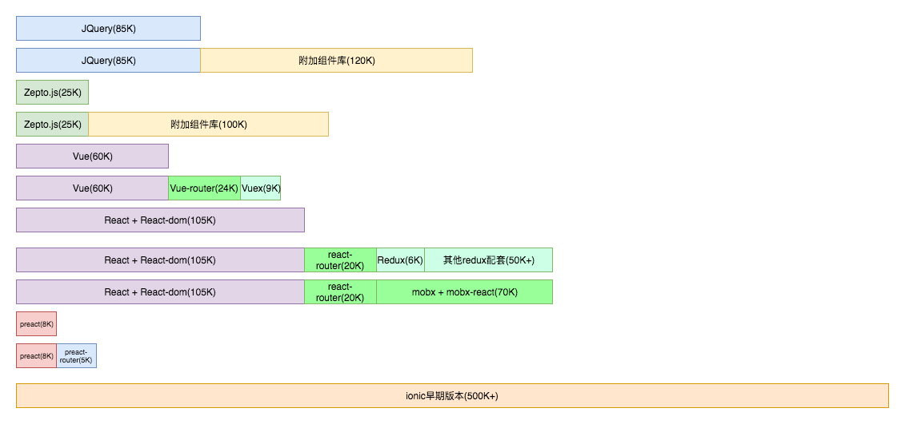

# 现状，瓶颈分析

本节旨在分析应用加载过程中的瓶颈和应对措施

* [现状，瓶颈分析](#现状瓶颈分析)
  * [1.应用加载过程](#1应用加载过程)
  * [2. 选型分析](#2-选型分析)
  * [3. 小结](#3-小结)
  * [4. 参考文献](#4-参考文献)

 

## 1.应用加载过程

先从整体看一个页面的加载过程 :

一个 HTML5 应用都会经历以上过程. 应用所谓的'加载慢'的问题, 最直观的原因就是**白屏时间过长**. 从上图可看出白屏期间主要做了：

1.  `webview 初始化`. 具体依赖平台和设备的性能和资源情况, 客户端通过某些手段可以进一步优化 webview 打开.
2.  `建立连接`. 建立连接依赖于网络情况, 服务器情况, 以及 DNS 等情况. 优化手段主要有减少连接数, 减少重定向数以及预解析域名手段.
3.  `接收页面, 以及其他静态资源`. 静态资源的体积, 除了影响下载速度, 还会影响解析速度.
    资源的下载主要依赖于服务器情况, 网络情况, 以及文件体积.
    主要的优化手段是缓存, 压缩, 简化程序减少体积, 开启 gzip, 服务端渲染等手段,
4.  `资源解析`. 浏览器是单线程的，在脚本解析和执行期间，浏览器是无法响应的。这个主要依赖的文件的体积。手段有合理地拆分文件，简化程序，减少第三方依赖.

 

具体看一下我们工作宝应用是如何加载的:

 

 

> 注: 以下数据以工作宝 Android 6.0 测试. 服务由阿里云提供

1.  首先`客户端`会携带一些会话信息(用户，当前语言，重定向 url)，以及向`EIM`进行认证并获取一个`Code`

    

    平均消耗在 115ms 左右

 

2.  EIM 响应，让浏览器携带 code 重定向应用服务器地址。应用服务器会在这里对 Code 进行解析和鉴权。并将用户信息保存在 session 中。

    

    平均消耗在 140ms 左右

    目前已存在的应用中对于 Code 有**三种处理方式**：

    * `日程`为代表的：鉴权完成同时返回页面(html)，浏览器可以直接渲染出来. 即直接通过 Java 的 template 渲染将页面，并在页面中携带用户信息
      

    * `考勤`为代表的: 鉴权完成后返回 302，让浏览器重定向获取 APP 的 index.html 入口
      

    * `位置`为代表的：从 EIM 获取到 Code 之后，直接跳转到 index.html 入口. 然后通过 getToken 和应用后端换取 Token, 后续使用 Token 的方式进行鉴权
      

    对比:

    * `日程`鉴权完成后立即返回页面, 是优于`考勤`的。考勤使用重定向的方式会让浏览器浪费一次请求. 但是基于当前前端应用的构建方式，html 文件是构建工具自动生成的。所以`考勤`的方式更方便一点
    * 而`位置`应用使用的方式则弥补了前面两者缺陷。在拿到 Code 后，马上开始获取页面，在请求资源渲染页面的同时向服务端鉴权。最大化地减少的白屏时间。
    * 更好的方案: 延迟认证

 

3.  拿到 html 页面后，浏览器开始渲染流程。因为我们使用前端渲染的方式，只有等到所有‘必须’的资源加载完毕之后，用户才能看到非空白页面。这个阶段才是前端能控制的‘主要战场’, 也是这次预研的主题

    

    按照最佳实践，单个文件的体积，应该控制在 250kb 以内，上图可以看到文件基本控制在 250k 左右，体积最大的是`ionic.min.js`达到 400k. 在开启gzip后，可以极大缩小传输体积.

    虽然体积还可以在缩小，但需要平衡开发效率和运行性能, 比如使用扫码登录就使用了`preact`, 这个精简版的`React`体积非常小，但是运行性能或者生态，是无法和`React`比较的。

    影响这个阶段页面加载的因素有很多, 主要因素是资源的体积大小和分配情况. 这个阶段我们能做些什么?

    * [x] 资源压缩, 压缩 JS 文件, CSS 文件,图片资源等
    * [x] 适当分割文件, 平衡并行下载数和连接数
    * [ ] 服务器 Gzip 压缩(目前没有开启, 开启能压缩 40%以上的文件体积)
    * [ ] 服务器动静分离, 让更专业的静态服务器来伺服静态文件( 比如 Nginx, 目前是 Java). 这个需要基准测试证明
    * [ ] 选择合适的技术栈, 减少依赖和代码重复, 平衡开发效率, 维护效率, 运行性能和首屏性能
    * [ ] 缓存优化. 这是本次的主题

 

## 2. 选型分析

下面是目前前端主流选型的 对比, 暂时不考虑运行性能, 因为随着版本的迭代, React, Vue, Angular 三大框架的性能 已经差距不大. 在本次话题中, 框架及其附属 周边的体积, 影响首屏渲染的成本会高一些:

 

 

由上图可以看到, 现代前端框架做了很多工作的同时, 依旧保持苗条的身材. 比如`Vue`的核心, 只有 60KB, 这 60KB 实现了等价于
`React + React-DOM + Mobx + Mobx-React`(180K)的工作.

更为惊艳的是, `Preact` 这款轻量版的 React 只有 8K 大小, 非常适合移动端 的开发. 目前最新开发的应用, 如`扫码登录`, `安全验证`以及`CSP扫码登录`
等都使用了 Preact, 整个应用的体积(包括 业务逻辑代码)可以控制 100KB, 甚至 50KB 以内. 它非常适合这种场景.

由于定位不一样, Angular 等框架 体积都非常庞大. 暂时 不再未来选项之列. Ionic 是一个组件库+运行时, 放在这里比较似乎有点不公平

所以相比而言, `Jquery`或`Zepto.js`以及不具备竞争能力( 目前还有其适用场景).

更多角度的排名:

 

| 体积(核心) | 体积(+ 周边)              | 生态(+活跃的)      | 运行效率                   | 开发 效率                | 代码量                   |
| ---------- | ------------------------- | ------------------ | -------------------------- | ------------------------ | ------------------------ |
| Preact     | Preact                    | React/Vue          | React/Vue/Augular          | React/Vue/Augular/Preact | React/Vue/Augular/Preact |
| Zepto      | Vue(Vue-Router, Vuex)     | Augular            | Preact                     | AugularJS                | AugularJS                |
| Vue        | Zepto                     | AugularJS/Jquery   | Jquery/Zepto(依赖于开发者) | Zepto/Jquery             | Zepto/Jquery             |
| Jquery     | React(React-Router, Mobx) | Preact(兼容 React) | AugularJS                  |
| React      | Jquery                    | Zepto              |
| Augular    | React(Redux)              |
| AugularJS  | Augular                   |
| Ionic      | AugularJS                 |
|            | Ionic                     |

 

## 3. 小结

 

通过上面分析可以得出, 目前应用加载慢的几点主要原因:

1.  获取应用前, 过多重定向. 如考勤和收藏 等应用,在真正获取页面之前 需要两次重定向. 而且这还依赖于客户端的连接情况.
    这经常发生在冷启动客户端时, 客户端有一定几率会卡死在这两次重定向中, 而且对 用户没有任何反馈.
2.  服务器未开启 Gzip. 这个对于静态资源下载来说影响较大
3.  静态资源伺服还有优化空间. 目前应用使用 Java 的 内嵌服务器 Jetty 服务器进行静态资源的伺服, 一般适用于`开发环境`,
    以支持快速开发. 由上面的例子中也可以看到, 静态资源连接的建立,响应的延迟都比较长,且不稳定, 而相比而言, Nginx 更适合静态资源的伺服.
    实现动静分离可以优化 Java 服务器性能和内存占用, 也可以提高静态资源的下载效率 
4.  应用体积还可以进一步优化. 选择合适的框架和裁剪 臃肿的依赖, 以及合理的 拆分, 可以较大的优化静态资源的体积.
5.  首屏优化, 目前加载的 html 页面是空白的, 预渲染应用外壳可以让 用户尽早地看到内容的渲染.

 

## 4. 参考文献

 

[嵌入式服务器 jetty，让你更快开发 web](https://cloud.tencent.com/developer/article/1014514)
